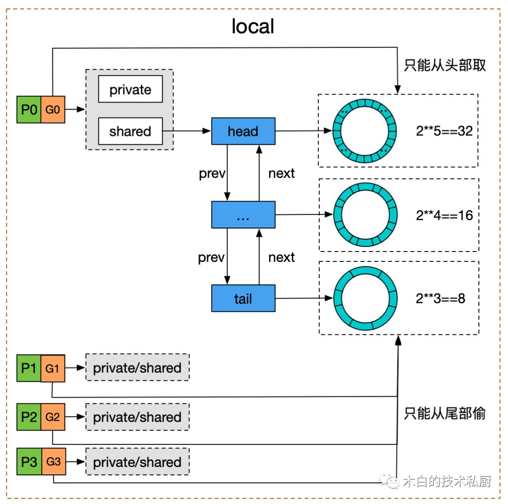

源码层面分析下golang高性能对象池的实现机制: [sync.Pool](https://go.dev/src/sync/pool.go)

<!--more-->

## Usage

`sync.Pool`提供对象池的管理能力, 对外接口有 `New` `Get` `Put` 这三个方法, 一个简单的示例:

```go
var pool *sync.Pool
type Person struct {
    Name string
}

func init() {
    pool = &sync.Pool{
        New: func() interface{}{
            fmt.Println("creating a new person")
            return new(Person)
        },
    }
}

func main() {
    person := pool.Get().(*Person)
    fmt.Println("Get Pool Object：", person)

    person.Name = "first"
    pool.Put(person)

    fmt.Println("Get Pool Object：",pool.Get().(*Person))
    fmt.Println("Get Pool Object：",pool.Get().(*Person))

}
```

输出:

```shell
creating a new person
Get Pool Object： &{}
Get Pool Object： &{first}
creating a new person
Get Pool Object： &{}
```

## Double Linked Ring-Buffer Queue

`sync.Pool`设计的关键要点:

1. 并发高性能: 在并发情况下, 可以高性能的`Put`和`Get`对象.
2. 内存弹性变化: 如果数据不再被使用, pool管理的数据可以GC\掉. 如果数据不够, 可自动用`New`出来新数据.

---

为了做到高性能, 最重要的是在每个P上(GMP调度模型), 都构建一个局部`poolLocal`. 在任何的`Get`和`Put`操作时, 先调用`Pin`方法
将当前G绑定到P上, 这样子后续所有的内存访问操作都是**单线程**的, 不存在并发问题.

> 有点类似`ThreadLocal`: 特定线程只能访问特定内存区域. 在golang中, 通过G绑定P, P绑定数据(通过pid映射),
> 实际上等价于特定内存只能被特定的G访问, 进而没有并发的问题.

```go
// pin pins the current goroutine to P, disables preemption and
// returns poolLocal pool for the P and the P's id.
// Caller must call runtime_procUnpin() when done with the pool.
func (p *Pool) pin() (*poolLocal, int) {
    pid := runtime_procPin()
    // In pinSlow we store to local and then to localSize, here we load in opposite order.
    // Since we've disabled preemption, GC cannot happen in between.
    // Thus here we must observe local at least as large localSize.
    // We can observe a newer/larger local, it is fine (we must observe its zero-initialized-ness).
    s := runtime_LoadAcquintptr(&p.localSize) // load-acquire
    l := p.local                              // load-consume
    if uintptr(pid) < s {
        return indexLocal(l, pid), pid
    }
    return p.pinSlow()
}
```

其中, `localSize`记录当前`localPool`的个数, 如果没有对应pid数据, 就是没有初始化: 后续会在`pinSlow()`方法中, 做延迟初始化, 默认会构造
`runtime.GOMAXPROCS(0)`个`localPool`.

这里存在一个问题: 如果`Get`方法在当前`localPool`上获取不到数据, 就会new新数据, 但实际上, 其余P上的`localPool`还有缓存的对象,
这会造成一定的内存浪费(并不能保证所有P上的缓存情况都一致, 肯定会出现特定P申请的多, 但释放的少).

为此, 并不是将`Get`和`Put`操作的内存都局限于当前P上, 而是`Put`单P访问, 但`Get`在当前P获取不到数据时, 会从其余P上的`localPool`
偷取数据. 所以, `localPool`数据结构被设计为**SPMC(single-producer-multi-consumer)**模式的并发安全队列.


```go
// poolChain is a dynamically-sized version of poolDequeue.
//
// This is implemented as a doubly-linked list queue of poolDequeues
// where each dequeue is double the size of the previous one. Once a
// dequeue fills up, this allocates a new one and only ever pushes to
// the latest dequeue. Pops happen from the other end of the list and
// once a dequeue is exhausted, it gets removed from the list.
type poolChain struct {
    // head is the poolDequeue to push to. This is only accessed
    // by the producer, so doesn't need to be synchronized.
    head *poolChainElt

    // tail is the poolDequeue to popTail from. This is accessed
    // by consumers, so reads and writes must be atomic.
    tail *poolChainElt
}

type poolChainElt struct {
    poolDequeue

    // next and prev link to the adjacent poolChainElts in this
    // poolChain.
    //
    // next is written atomically by the producer and read
    // atomically by the consumer. It only transitions from nil to
    // non-nil.
    //
    // prev is written atomically by the consumer and read
    // atomically by the producer. It only transitions from
    // non-nil to nil.
    next, prev *poolChainElt
}

// poolDequeue is a lock-free fixed-size single-producer,
// multi-consumer queue. The single producer can both push and pop
// from the head, and consumers can pop from the tail.
//
// It has the added feature that it nils out unused slots to avoid
// unnecessary retention of objects. This is important for sync.Pool,
// but not typically a property considered in the literature.
type poolDequeue struct {
    // headTail packs together a 32-bit head index and a 32-bit
    // tail index. Both are indexes into vals modulo len(vals)-1.
    //
    // tail = index of oldest data in queue
    // head = index of next slot to fill
    //
    // Slots in the range [tail, head) are owned by consumers.
    // A consumer continues to own a slot outside this range until
    // it nils the slot, at which point ownership passes to the
    // producer.
    //
    // The head index is stored in the most-significant bits so
    // that we can atomically add to it and the overflow is
    // harmless.
    headTail uint64

    // vals is a ring buffer of interface{} values stored in this
    // dequeue. The size of this must be a power of 2.
    //
    // vals[i].typ is nil if the slot is empty and non-nil
    // otherwise. A slot is still in use until *both* the tail
    // index has moved beyond it and typ has been set to nil. This
    // is set to nil atomically by the consumer and read
    // atomically by the producer.
    vals []eface
}
```

数据结构设计上有几点很有意思:

- 使用`ring-buffer-queue`作为实际最底层存储队列, 对内存更友好, 而且实现**lock-free SPMC**也相对低复杂度.
- 上层使用**双层链表**来串所有`ring-buffer-queue`, 这可以更好的扩展队列容量, 不会出现没有办法`Put`进而阻塞的情况
- 每次扩展`ring-buffer-quene`都是double size, 等于是一种渐进式提升消耗的方式: 在高QPS情况下, 使得**链表的长度更短**.

另外, 为了适配QPS压力不大的情况, 在`poolLocal`中, 默认提供一个占位用的`private`对象: 优先只消耗这个`private`对象, 而不是去构造复杂的`double-linked-ring-buffer-queue`. 具体可以看下`Get()`的代码:



```go
// Local per-P Pool appendix.
type poolLocalInternal struct {
    private interface{} // Can be used only by the respective P.
    shared  poolChain   // Local P can pushHead/popHead; any P can popTail.
}

type poolLocal struct {
    poolLocalInternal

    // Prevents false sharing on widespread platforms with
    // 128 mod (cache line size) = 0 .
    pad [128 - unsafe.Sizeof(poolLocalInternal{})%128]byte
}

// Get selects an arbitrary item from the Pool, removes it from the
// Pool, and returns it to the caller.
// Get may choose to ignore the pool and treat it as empty.
// Callers should not assume any relation between values passed to Put and
// the values returned by Get.
//
// If Get would otherwise return nil and p.New is non-nil, Get returns
// the result of calling p.New.
func (p *Pool) Get() interface{} {
    l, pid := p.pin()

    // 优先从private后去, Put也优先放在private上面(都在pin的情况下)
    x := l.private
    l.private = nil
    if x == nil {
        // 在pin的情况下, 优先从head读取数据, 这样子局部性更好
        // 而且底层实现, 可以认为这里是单线程运行, 不会太复杂
        // Try to pop the head of the local shard. We prefer
        // the head over the tail for temporal locality of
        // reuse.
        x, _ = l.shared.popHead()
        if x == nil {
            x = p.getSlow(pid)
        }
    }
    runtime_procUnpin()
    if x == nil && p.New != nil {
        x = p.New()
    }
    return x
}
```

而如果本地找不到, 就会去别的`localPool`偷, 实现在`getSlow`方法: `multi-consumer`并发去偷就并非线程安全: 底层通过CAS操作实现无锁, 相对比较复杂就不贴了.

```go
func (p *Pool) getSlow(pid int) interface{} {
    // See the comment in pin regarding ordering of the loads.
    size := runtime_LoadAcquintptr(&p.localSize) // load-acquire
    locals := p.local                            // load-consume
    // Try to steal one element from other procs.
    for i := 0; i < int(size); i++ {
        l := indexLocal(locals, (pid+i+1)%int(size))

        // 这个接口就不是线程安全的了, 底层
        if x, _ := l.shared.popTail(); x != nil {
            return x
        }
    }

    // Try the victim cache. We do this after attempting to steal
    // from all primary caches because we want objects in the
    // victim cache to age out if at all possible.
    size = atomic.LoadUintptr(&p.victimSize)
    if uintptr(pid) >= size {
        return nil
    }
    locals = p.victim
    l := indexLocal(locals, pid)
    if x := l.private; x != nil {
        l.private = nil
        return x
    }
    for i := 0; i < int(size); i++ {
        l := indexLocal(locals, (pid+i)%int(size))
        if x, _ := l.shared.popTail(); x != nil {
            return x
        }
    }

    // Mark the victim cache as empty for future gets don't bother
    // with it.
    atomic.StoreUintptr(&p.victimSize, 0)

    return nil
}
```

## Clean Up

`sync.Pool`在负载情况下, 会根据压力自动构造底层`double-linked-ring-buffer-queue`来缓存对象指针, 进而有效降低GC压力. 但如果负载降低下来, 这些缓存的对象该如何清理呢.

`sync.Pool`默认没有提供清理的接口和策略, 主要处理逻辑是在GC STW时, 清空缓存数据. 但为防止清空后,瞬间`Get`的压力太大, 在正式清空前, 会利用victim(牺牲者)作为缓冲区, 等待到下一个GC时, 再完全清空:

```go
func poolCleanup() {
    for _, p := range oldPools {
        p.victim = nil
        p.victimSize = 0
    }

    for _, p := range allPools {
        p.victim = p.local
        p.victimSize = p.localSize
        p.local = nil
        p.localSize = 0
    }

    oldPools, allPools = allPools, nil
}

func init() {
    runtime_registerPoolCleanup(poolCleanup)
}
```

> `vicitm cache`是从CPUcache系统中提取的[概念](https://www.quora.com/What-is-a-victim-cache)
>
> A victim cache allocates only lines written back from a higher level cache. There will be no allocations on fill data as part of read miss.
> For eg: In a multi core processor with 3 levels of cache, the L3 cache could be designed as victim cache (though not necessarily always)
>
> In this case, any read miss from the core will only allocate in L1 and L2 cache as data is fetched from main memory. When L1/L2 cache evicts a line, it gets allocated in the L3 victim cache. This works on the principle that since those lines had **a locality of reference and was evicted because of capacity limitation, there is a good chance of getting referred again**. In that case, reading from L3 is still faster than reading from main memory

这么拆解理解:

- 首先不能不清空数据, 否则一直cache数据, 后续如不用的话就是内存浪费.
- 清空后, 主要压力在`Get`: 因为如果击穿缓存需要重新`New`, 而`Put`只需要构造一些slots保存缓存, 开销压力并不大.
- vicim等于是一个临时buffer, 让`Get`在重压力下不会轻易被击穿, 但后续如压力下来, 终态也会清空数据. 一定程度上说, 用vicim buffer的方式, 平滑了内存被清空的速度, 但额外消耗了空间: 等于是一个空间和性能的tradeoff.

## References

- [深度分析 Golang sync.Pool 底层原理](https://www.cyhone.com/articles/golang-waitgroup/)
- [多图详解Go的sync.Pool源码](https://www.cnblogs.com/luozhiyun/p/14194872.html)
