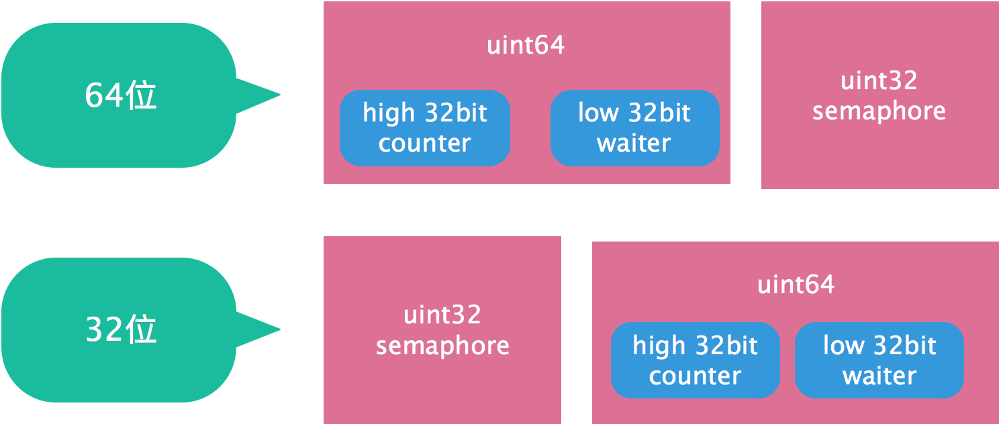

源码层面分析golang并发控制组件: [sync.WaitGroup](https://go.dev/src/sync/waitgroup.go)

<!--more-->

`sync.WaitGroup`主要用来做goroutine的fan-out管理, 主goroutine`Add`等待的任务个数 然后fan-out的goroutine完成`Done`任务, 主goroutine`Wait`到所有任务完成.

## Semaphore

信号量是一种保护共享资源的机制，用于解决多线程同步问题。信号量s是非负整数值，只能由两种特殊操作来处理:

- `P(s)`：如果s是非零，P将s减1，并且立即返回。如果s为零，那么就挂起这个线程，直到s变为非零，等到另一个执行`V(s)`操作的线程唤醒该线程。在唤醒之后，P操作将s减1，并将控制返回给调用者。
- `V(s)`：V操作将s加1。如果有任何线程阻塞在P操作等待s变为非零，那么**V操作会唤醒这些线程中的一个，该线程将s减1，完成它的P操作**。

对标Go的底层信号量函数:

- `runtime_Semacquire(s *uint32)`: 函数会阻塞goroutine直到信号量s的值大于0，然后原子性地减这个值，即P操作。
- `runtime_Semrelease(s *uint32, lifo bool, skipframes int)`: 函数原子性增加信号量的值，然后通知被runtime_Semacquire阻塞的goroutine，即V操作。

## Memory Structure

内存结构的关键是`[3]uint32`的组合数据结构, 包含:

- `counter`: 待完成任务个数
- `waiter`: 等待任务完成的goroutine数量
- `sema`: 同步waiter的等待和唤醒信号量

为了做到无锁, counter和waiter被pack成一个`int64`对象进行atomic操作:

- `Add`会同时获取当前counter和waiter数值, 读取并赋值, 看成一个整体便于做atomic变更.
- 逻辑上可认为是定义了一个`int64`结构体进行CAS, 保证并发安全.

而将sema也放在一起定义可减少因内存对齐而额外4B padding. 但这样子引入一个额外的问题, atomic int64操作需要对象64位对齐, 但在32位编译器下, 可能存在(不是一定, 因为可能刚好也64位对齐了)没有对齐的情况. 所以代码用`state()`函数做了自动64位对齐语义.

```go
// A WaitGroup waits for a collection of goroutines to finish.
// The main goroutine calls Add to set the number of
// goroutines to wait for. Then each of the goroutines
// runs and calls Done when finished. At the same time,
// Wait can be used to block until all goroutines have finished.
//
// A WaitGroup must not be copied after first use.
type WaitGroup struct {
    noCopy noCopy

    // 64-bit value: high 32 bits are counter, low 32 bits are waiter count.
    // 64-bit atomic operations require 64-bit alignment, but 32-bit
    // compilers do not ensure it. So we allocate 12 bytes and then use
    // the aligned 8 bytes in them as state, and the other 4 as storage
    // for the sema.
    state1 [3]uint32
}

// state returns pointers to the state and sema fields stored within wg.state1.
func (wg *WaitGroup) state() (statep *uint64, semap *uint32) {
    // 刚好对齐, 直接使用
    if uintptr(unsafe.Pointer(&wg.state1))%8 == 0 {
        return (*uint64)(unsafe.Pointer(&wg.state1)), &wg.state1[2]
    } else {
        // 没有对齐, 刚好用sema做为padding
        return (*uint64)(unsafe.Pointer(&wg.state1[1])), &wg.state1[0]
    }
}
```



> 真是把内存和并发tradeoff到了极致

## Add/Wait/Done

- 核心逻辑是基于接口操作counter和waiter, 然后在counter=0的情况下, 发送信号量, 唤醒所有waiter.
- `Wait`如果发现counter=0就直接返回, 否则等待信号换新(如信号二字, sema这里就是一种同步信号, 等待完成的信号 + 完成后发送信号)

由于无锁的方式来访问和修改counter和waiter, 控制并不好做到非常精细. 考虑下面的load-process-set的可能并发问题:

- `Done`原子修改counter, 发现counter变为0, 准备唤醒所有waiter. 但如果这时并发新增一个waiter, 那就**不会被唤醒**(因为只会唤醒load时刻记录的waiter个数). 当然, 这里可以用for-load-process-cas方式来乐观加锁, 但肯定会增加复杂度和消耗.
- `Wait`在被唤醒后, 如果发现counter不是0, 等于被**虚假唤醒**, 那更麻烦需要重新让自己等待信号, 且修改waiter的个数.

总的说来, 因为考虑性能使用原子操作和CAS, 必然控制粒度就比较细, 异常并发问题如需处理会比较复杂(可能第二个case就必须要加锁, 类似实现一个**条件变量**). 所以使用时规范约束: **一旦`Done`触发唤醒逻辑, 就需等待所有`Wait`完成, 期间不能再并发的修改数据.**

> 考虑到`sync.WaitGroup`的使用场景, 上述约束make sense: 有效降低复杂度和提升并发性能(不需要为corner case进行额外for-loop). 一个启示是: 设计高优考虑主场景运行, 如果corner case复杂, 可放弃corner case, 转而约束用户使用, 反而是更好的解法.

```go
// Add adds delta, which may be negative, to the WaitGroup counter.
// If the counter becomes zero, all goroutines blocked on Wait are released.
// If the counter goes negative, Add panics.
//
// Note that calls with a positive delta that occur when the counter is zero
// must happen before a Wait. Calls with a negative delta, or calls with a
// positive delta that start when the counter is greater than zero, may happen
// at any time.
// Typically this means the calls to Add should execute before the statement
// creating the goroutine or other event to be waited for.
// If a WaitGroup is reused to wait for several independent sets of events,
// new Add calls must happen after all previous Wait calls have returned.
// See the WaitGroup example.
func (wg *WaitGroup) Add(delta int) {
    statep, semap := wg.state()
    state := atomic.AddUint64(statep, uint64(delta)<<32)
    v := int32(state >> 32)
    w := uint32(state)
    if v < 0 {
        panic("sync: negative WaitGroup counter")
    }
    if w != 0 && delta > 0 && v == int32(delta) {
        panic("sync: WaitGroup misuse: Add called concurrently with Wait")
    }
    if v > 0 || w == 0 {
        return
    }

    // This goroutine has set counter to 0 when waiters > 0.
    // Now there can't be concurrent mutations of state:
    // - Adds must not happen concurrently with Wait,
    // - Wait does not increment waiters if it sees counter == 0.
    // Still do a cheap sanity check to detect WaitGroup misuse.
    // Note: 对应上面说的第一个异常情况
    if *statep != state {
        panic("sync: WaitGroup misuse: Add called concurrently with Wait")
    }

    // Reset waiters count to 0.
    *statep = 0
    for ; w != 0; w-- {
        runtime_Semrelease(semap, false, 0)
    }
}

// Done decrements the WaitGroup counter by one.
func (wg *WaitGroup) Done() {
    wg.Add(-1)
}

// Wait blocks until the WaitGroup counter is zero.
func (wg *WaitGroup) Wait() {
    statep, semap := wg.state()
    for {
        state := atomic.LoadUint64(statep)
        v := int32(state >> 32)
        w := uint32(state)
        if v == 0 {
            return
        }
        // Increment waiters count.
        if atomic.CompareAndSwapUint64(statep, state, state+1) {
            runtime_Semacquire(semap)

            // Note: 对应上面说的第二个异常情况
            if *statep != 0 {
                panic("sync: WaitGroup is reused before previous Wait has returned")
            }
            return
        }
    }
}
```

## References

- [最清晰易懂的 Go WaitGroup 源码剖析](https://segmentfault.com/a/1190000039855743)
- [详解 Go 中 WaitGroup 源码设计](https://juejin.cn/post/7005565255736639524#heading-11)
