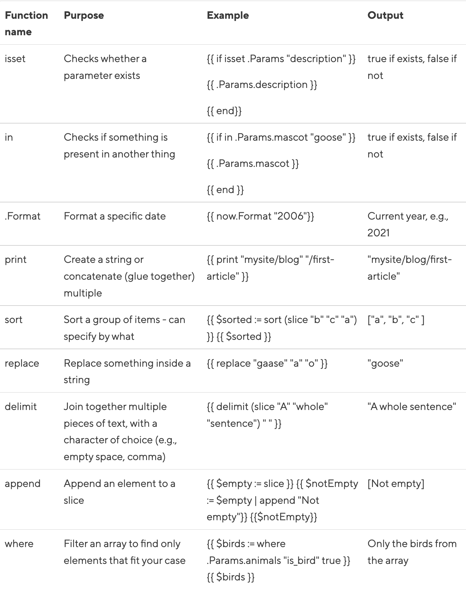

记录折腾博客生成引擎[hugo](https://gohugo.io/getting-started/quick-start/)学习内容

<!--more-->

## hugo usage

hugo server自带livereload功能（原理是hook js代码到返回的html页面，进而在加载时，和服务端构建ws连接执行refresh推送）

通过`hugo server --navigateToChanged`命令, 可以自动加载到最新变更的文件

hugo设计有environment的概念，用来隔离不同的使用场景：

- `hugo server`默认使用development模式, 等价于`--environment development`
- `hugo`默认使用production模式, 等价于`--envirnment production`

hugo的保存资源的路径:

- **archetypes**: this is where you create default front matter for content. Front matter is a way to set metadata for a page but more on this later.
- **config.toml**: default configuration for your project goes here. YAML and JSON are also supported if you prefer.
- **assets** (not a default folder): anything that requires processing by Hugo Pipes (such as SCSS or images) lives here.
- **content**: all your content (generally markdown) for pages lives here.
- **data**: supplemental data files live, acting as a surrogate “database”.
- **layouts**: all page templates for your content folder live here. There are some strict conventions to get your head around, but we’ll get to that later.
- **static**: contains all your assets that don’t need processing. Hugo will simply copy any files here to your built site without touching them.
- **themes**: any themes you’re using can be added here.

> assets和static不同, assets还会经过pipes加工, 而static会直接copy到最终发布的目录中
> layouts和content相互镜像, layouts配置显示的设置, 而content负责描述自己的内容. 比如  `context/blog` 和 `layouts/blog` 会对齐后生成内容

hugo自带的配置清单[参考这里](https://gohugo.io/getting-started/configuration/).

archetype可以配置目录结构的[page bundles](https://gohugo.io/content-management/page-bundles/), 比如下面的

```bash
archetypes
├── default.md
└── post-bundle
    ├── bio.md
    ├── images
    │   └── featured.jpg
    └── index.md
```

下面命令, 就会创建`content/posts/my-post`目录, 其还是一个posts类型的page, 但会基于bundle形式来创建.

```bash
# 使用kind来设定archetypes的类型
# 在hugo中, 实际上领域名词叫做type, 但这里应该是`-t`已经被themes使用, 所以用-k来制定
hugo new -k post-bundle posts/my-post
```

### go templating basics

```go
{{ $animals := .Params.animals }}
{{ $animals }}
```

---

```go
{{ range $animals }}
  <p>{{ .name }}</p>
{{ end }}
```

这里的`.`表示当前上下文变量, 也就是 for 循环展开的 animals 对应具体对象.

---

```go
{{ range $index, $animal := range $animals }}
  <p>{{ add $index 1 }}: {{ $animal.name }}</p>
{{ end }}
```

这里的`add`方法用来让坐标从 1 开始

---

```go
{{ range $index, $animal := .Params.animals }}
  {{ if eq $animal.is_bird true }}
    <p> A {{$animal.name}} is a bird.</p>
  {{ else }}
    <p> A {{$animal.name}} is not a bird.</p>
  {{ end }}
{{ end }}
```

这里使用字面的英文来表示比较操作符: eq/ne/lt/le/gt/ge

---

```go
{{ $s := slice "kea" "kaka" "tui" }}
{{ $d := dict "year" (now.Format "2006")}}
```

注意, 这里使用空格来区分不同的 items

---


---

```go
// if set description, use description
{{ with .Param "description" }}
    // context here means .Param.description
    {{ . }}
{{ else }}
    // else use .Summary
    {{ .Summary }}
{{ end }}
```

---

```go
{{ if isset .Params "caption" | or isset .Params "title" | or isset .Params "attr" }}
  Stuff here
{{ end }}

// index操作符用来dict或者slice中提取元素, 和dot操作符一样, 只是输入的key是动态的
{{ index .Params "disqus_url" | html }}
```

## themes

### LoveIt

国人开发，支持贴近国人生产相关的shortcodes，使用文档可以[参考](https://hugoloveit.com/zh-cn/)