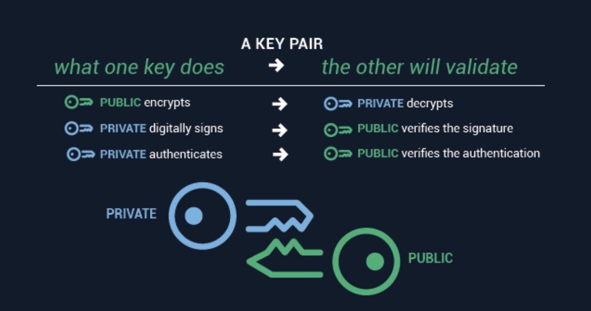
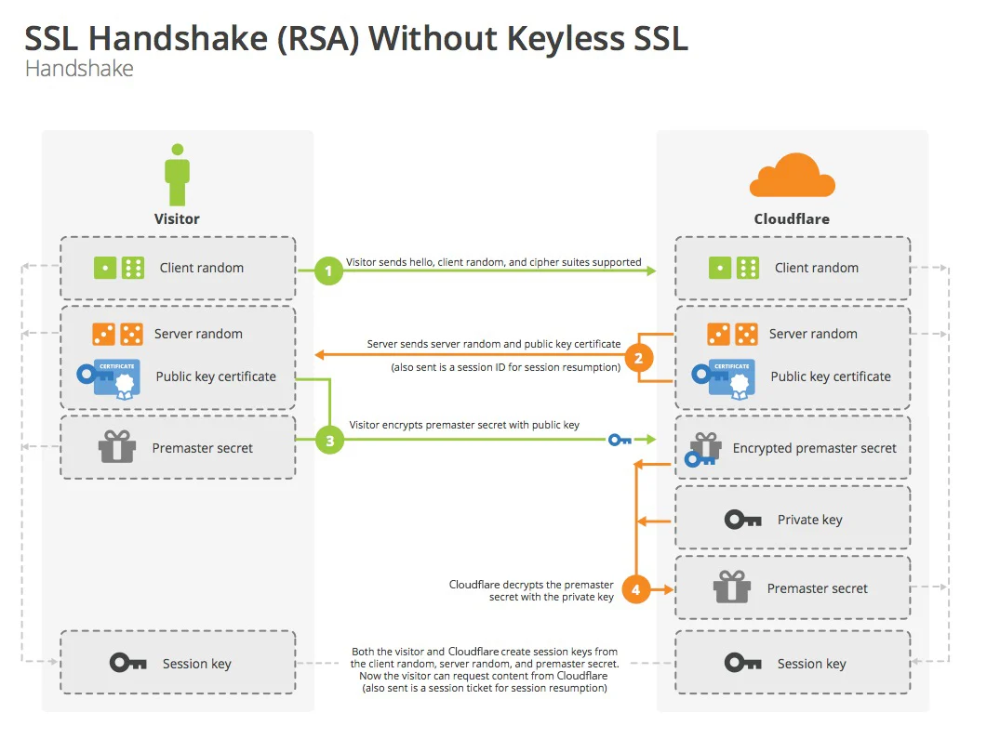
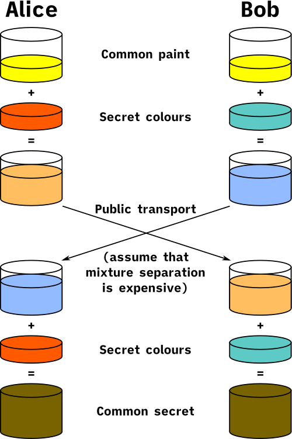
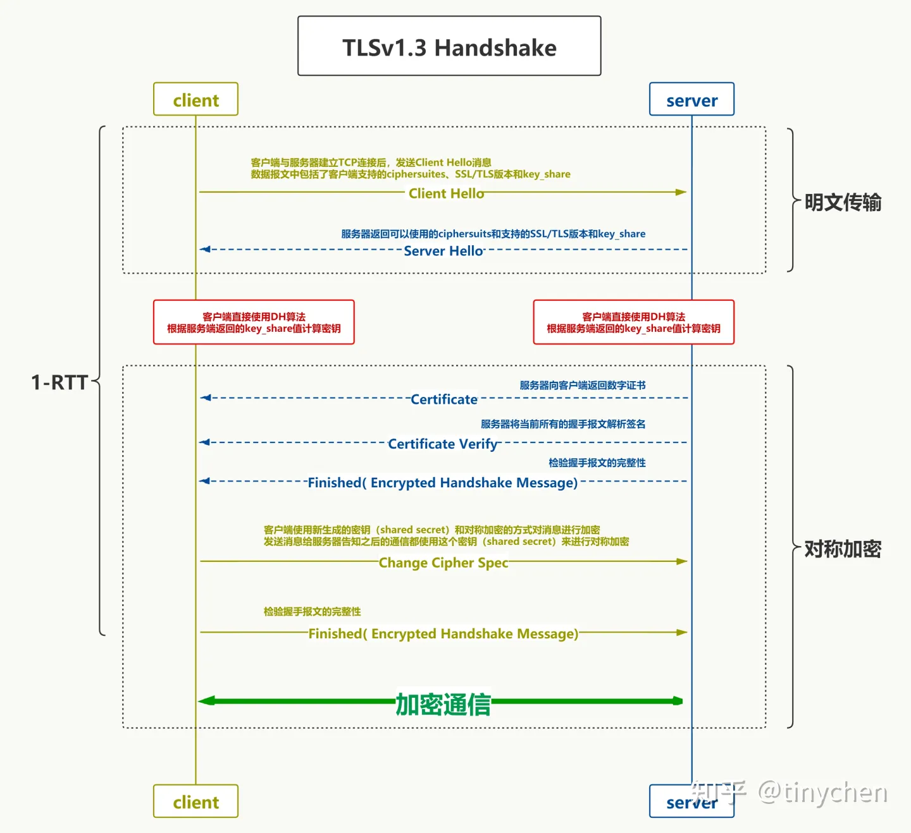

学习鉴权相关技术的记录.

<!--more-->

## JWT(json web token)

> JSON Web Token (JWT) is an open standard (RFC 7519) that defines a compact and self-contained way for securely transmitting information between parties as a JSON object. This information can be verified and trusted because it is digitally signed. JWTs can be signed using a secret (with the HMAC algorithm) or a public/private key pair using RSA or ECDSA.

JWT有3个部分复合而成, 形式上为`header.payload.signature`:

- header: 记录元信息, 比如签名的方法

```json
{
    "alg": "RS256",
    "typ": "JWT"
}
```

- payload: 实际透传内容, 需使用`Base64URLEncode`来编码

```bash
echo -n '{"sub": "1234567890", "name": "John Doe", "admin": true}' | base64 \
    | tr -d "\n=" \     # 去掉换行和=号
    | tr "+/" "-_"      # 替换base64编码为url方式
```

因为JWT可能被放在`URL`请求参数中, 所以内容必须是纯文本, 且不能有`HTTP`协议特殊字符. 标准base64编码使用`+/`编码, 这里需要改为`_-`:

```go
const encodeStd = "ABCDEFGHIJKLMNOPQRSTUVWXYZabcdefghijklmnopqrstuvwxyz0123456789+/"
const encodeURL = "ABCDEFGHIJKLMNOPQRSTUVWXYZabcdefghijklmnopqrstuvwxyz0123456789-_"
```

- signature

> A digital signature is a mathematical technique used to validate the authenticity and integrity of a message, software or digital document. It's the digital equivalent of a handwritten signature or stamped seal, but it offers far more inherent security. A digital signature is intended to solve the problem of tampering and impersonation in digital communications.

数字签名可保证payload数据完整性以及不可伪造篡改. 其计算机制可描述为: `secret(hash(base64(header) + "." + base64(payload)))`.

其中, `hash`方法提取摘要信息, `secret`用来加密或者混淆数据. `hash`保证完整性, 且提取的摘要信息不会太大; 而`secret`方法保证数据不可伪造篡改: 别人即使知道计算方法, 也没法知道`secret`, 也就没法正向伪造出签名.

签名的另一面是验证, 其逻辑和构造签名一样: **就是重新计算一遍**: 验证计算结果和原始签名一致, 就可说明数据本身是完整的, 且没有被恶意伪造或者篡改.


---

JWT常用的计算算法有`HMAC SHA256(HS256)`和`RSA SHA256(RS256)`, 前者是对称加密, 后者是非对称加密.

在分布式系统中, 私钥一般不会大范围共享的, 更多是共享公钥, 所以用`RS256`方法更安全. 其计算公式为:

```golang
// RSA中, 一般用公钥做加密, 而私钥用来解密, 所以这里用encrypt.
// 那么对应的, 签名流程中描述的secret, 就是用私钥进行decrypt.
// 在RSA中, 先用公钥加密再用私钥解密 == 先用私钥解密再用公钥加密
// @see https://github.com/golang-jwt/jwt/blob/main/rsa.go#L49
rsa.encrypt(
    SHA256(
        base64UrlEncode(header) + "." +
        base64UrlEncode(payload)
    ),
    rsa_public_key
)
```



可以用`openssl dgst`进行签名和验证, [参考文章](https://techdocs.akamai.com/iot-token-access-control/docs/generate-jwt-rsa-keys):

```bash
# 加签
echo -n '{"sub": "1234567890", "name": "John Doe", "admin": true}' | base64 \
    | tr -d "\n=" \
    | tr "+/" "-_" \
    | openssl dgst -sha256 -binary -sign jwt-private.pem -out sign.temp

# 验签
echo -n '{"sub": "1234567890", "name": "John Doe", "admin": true}' | base64 \
    | tr -d "\n=" \
    | tr "+/" "-_" \
    | openssl dgst -sha256 -verify jwt-public.pem -signature sign.temp
```

## RSA

非对称加密算法:

- 介绍RSA算法计算过程的youtube: [RSA algorithm step by step example](https://www.youtube.com/watch?v=j2NBya6ADSY)
- [一文详解 RSA 非对称加密算法](https://www.cnblogs.com/xiaxveliang/p/12395993.html)

非对称加密算法的设计要比对称算法难得多，在 TLS 里只有很少的几种，比如 DH、DSA、RSA、ECC 等。

- RSA 可能是其中最著名的一个，几乎可以说是非对称加密的代名词，它的安全性基于**大整数分解**的数学难题，使用两个超大素数的乘积作为生成密钥的材料，想要从公钥推算出私钥是非常困难的。10 年前 RSA 密钥的推荐长度是 1024，但随着计算机运算能力的提高，现在 1024 已经不安全，普遍认为至少要 2048 位。
- ECC（Elliptic Curve Cryptography）是非对称加密里的“后起之秀”，它基于**椭圆曲线离散对数**的数学难题，使用特定的曲线方程和基点生成公钥和私钥，子算法 ECDHE 用于密钥交换，ECDSA 用于数字签名。

比起 RSA，ECC 在安全强度和性能上都有明显的优势。160 位的 ECC 相当于 1024 位的 RSA，而 224 位的 ECC 则相当于 2048 位的 RSA。因为密钥短，所以相应的计算量、消耗的内存和带宽也就少，加密解密的性能就上去了，对于现在的移动互联网非常有吸引力。

---

对称加密算法:

- DES: Data Encryption Standard
- AES: Advanced Encryption Standard, [How does AES encryption work? Advanced Encryption Standard
](https://www.youtube.com/watch?v=lnKPoWZnNNM)

## X.509

[what is an X.509 Certificate](https://www.ssl.com/faqs/what-is-an-x-509-certificate/)

> X.509 is a standard format for public key certificates, digital documents that securely associate cryptographic key pairs with identities such as websites, individuals, or organizations.
>
> X.509 certificate includes a public key, digital signature, and information about both the identity associated with the certificate and its issuing certificate authority (CA)

## CA(Certificate Authority)

 CA（Certificate Authority，证书认证机构）就像网络世界里的公安局、教育部、公证中心，具有极高的可信度，由它来给各个公钥签名，用自身的信誉来保证公钥无法伪造，是可信的。CA 对公钥的签名认证也是有格式的，不是简单地把公钥绑定在持有者身份上就完事了，还要包含序列号、用途、颁发者、有效时间等等，把这些打成一个包再签名，完整地证明公钥关联的各种信息，形成“数字证书”（Certificate）。

知名的 CA 全世界就那么几家，比如 DigiCert、VeriSign、Entrust、Let’s Encrypt 等，它们签发的证书分 **DV、OV、EV** 三种，区别在于可信程度。

> DV 是最低的，只是域名级别的可信，背后是谁不知道。EV 是最高的，经过了法律和审计的严格核查，可以证明网站拥有者的身份（在浏览器地址栏会显示出公司的名字，例如 Apple、GitHub 的网站）。

不过，CA 怎么证明自己呢？

这还是信任链的问题。小一点的 CA 可以让大 CA 签名认证，但链条的最后，也就是Root CA，就只能自己证明自己了，这个就叫“自签名证书”（Self-Signed Certificate）或者“根证书”（Root Certificate）。你必须相信，否则整个证书信任链就走不下去了。


## SSO

## HTTPS

### TLS v1.2

HTTPS最关键逻辑在于握手阶段:

- 获取访问网站的证书并验证.
- 基于验证后的证书公钥加密传输**临时随机密码**.
- 后续基于临时密码做对称加密通信.



### TLS v1.3

TLS v1.3在2018年推出, 相比2008年的v1.2协议, 在多处进行升级: [具体参考](https://learn.lianglianglee.com/%E4%B8%93%E6%A0%8F/%E9%80%8F%E8%A7%86HTTP%E5%8D%8F%E8%AE%AE/27%20%20%E6%9B%B4%E5%A5%BD%E6%9B%B4%E5%BF%AB%E7%9A%84%E6%8F%A1%E6%89%8B%EF%BC%9ATLS1.3%E7%89%B9%E6%80%A7%E8%A7%A3%E6%9E%90.md)

其中, 最重要的是规约秘钥交换协议只使用[Diffie Hellman Key Exchange](https://en.wikipedia.org/wiki/Diffie%E2%80%93Hellman_key_exchange)算法:

> The process begins by having the two parties, Alice and Bob, publicly agree on an arbitrary starting color that does not need to be kept secret. In this example, the color is yellow. Each person also selects a secret color that they keep to themselves – in this case, red and cyan. The crucial part of the process is that Alice and Bob each mix their own secret color together with their mutually shared color, resulting in orange-tan and light-blue mixtures respectively, and then publicly exchange the two mixed colors. Finally, each of them mixes the color they received from the partner with their own private color. The result is a final color mixture (yellow-brown in this case) that is identical to their partner's final color mixture.



---

该算法可以在1-RTT中就完成所有https需要的handshake工作: 协议版本, shared key, 证书传输:



### SNI(Server Name Indication)

在 HTTP 协议里，多个域名可以同时在一个 IP 地址上运行，这就是“虚拟主机”，Web 服务器会使用请求头里的 Host 字段来选择。

但在 HTTPS 里，因为**请求头只有在 TLS 握手之后才能发送**，在握手时就必须选择“虚拟主机”对应的证书，TLS 无法得知域名的信息，就只能用 IP 地址来区分。所以，最早时候每个 HTTPS 域名必须使用独立的 IP 地址，非常不方便。

那么怎么解决这个问题呢？

这还是得用到 TLS 的“扩展”，给协议加个**SNI（Server Name Indication）的“补充条款”**。它的作用和 Host 字段差不多，客户端会在“Client Hello”时带上域名信息，这样服务器就可以根据名字而不是 IP 地址来选择证书。

```
Extension: server_name (len=19)
    Server Name Indication extension
        Server Name Type: host_name (0)
        Server Name: www.chrono.com
```

Nginx 很早就基于 SNI 特性支持了 HTTPS 的虚拟主机，但在 OpenResty 里可还以编写 Lua 脚本，利用 Redis、MySQL 等数据库更灵活快速地加载证书。
